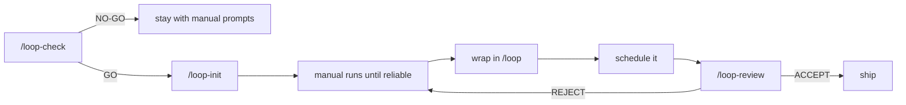

<div align="center">


# Loop Harness

**Loop engineering harness for Claude Code. Stop prompting by hand: design the system that prompts.**

[Features](#features) · [Installation](#installation) · [Usage](#usage) · [Loop anatomy](#anatomy-of-a-scaffolded-loop) · [Methodology](#methodology)

</div>

A *loop* is a small system that finds work, hands it to a coding agent, checks the result against an objective gate, records what happened, and decides the next move, all without a human prompting each step. Done well, it turns repetitive engineering chores (CI triage, lint fixes, dependency bumps) into something that runs while you sleep. Done badly, it burns tokens agreeing with itself.

loop-harness packages the discipline as four Claude Code skills and one agent. Its first job is to tell you **NO-GO**: most tasks don't deserve a loop, and the qualification gate exists to stop you from building automation that costs more than it returns. When a task does qualify, it scaffolds the loop's contract, working memory, and verification gate in one command, then reviews the loop's output with a checker that never trusts the maker.



## Features

- **Qualification gate.** The 2-condition test and checklist decide go/no-go before any loop exists.
- **One-command scaffolding.** `/loop-init` generates the loop's skill, state file, and standing spec into any project.
- **State that survives sessions.** `STATE.md` (working memory) plus `VISION.md` (a contract reread every run) prevent restarts and goal drift.
- **Maker/checker split.** The `loop-verifier` agent reruns the gate itself and judges scope independently. The agent that wrote the code never grades it.
- **Hard security boundaries.** Architecture, auth, and payments are refused at the gate, and prefilled "never do" rules ship in every scaffold.
- **Zero dependencies.** Pure markdown skills: nothing to build, nothing to update.

## What's inside

| Component | Kind | Purpose |
|---|---|---|
| `/loop-check` | skill | Go/no-go test for a candidate loop |
| `/loop-init` | skill | Scaffolds a loop into the current project |
| `/loop-review` | skill | Runs the independent verifier on a loop's output |
| `loop-engineering` | skill | The methodology; auto-triggers when you design or debug loops |
| `loop-verifier` | agent | Read-only checker: reruns the gate, rejects scope creep |

## Installation

Install with [skills](https://github.com/vercel-labs/skills), no clone needed:

```sh
npx skills add breim/loop-harness
```

This installs all four skills with their bare names (`/loop-check`, `/loop-init`, `/loop-review`). Add `-g` for a global (user-level) install, and update later with `npx skills update`. Works with Claude Code, Codex, Cursor, and every other agent the skills CLI supports.

### Alternative: Claude Code plugin

```
/plugin marketplace add breim/loop-harness
/plugin install loop-harness@loop-harness
```

The plugin form namespaces the commands (`/loop-harness:loop-check`) and also installs the `loop-verifier` agent. Update with `/plugin marketplace update loop-harness`.

### Development install

To hack on the skills themselves, clone this repository and run the installer:

```sh
./install.sh
```

It symlinks the skills and the agent into `~/.claude/`, keeping this repository as the source of truth so edits propagate without reinstalling. Idempotent: re-run it anytime, from any directory. Open a new Claude Code session and type `/loop-check` to confirm the skills loaded.

> [!NOTE]
> Scaffolding writes into the target project's `.claude/` directory, which Claude Code protects with an approval prompt. That one click is intentional: creating a new loop should pass through a human.

## Usage

### `/loop-check [task]`: should this be a loop at all?

```
> /loop-check triage failing CI runs every night

**GO** (all conditions pass)
Gate: npm test (exit code 0). Suggested hard stop: 10 iterations/run.
Next: /loop-init ci-triage
```

Tasks that touch auth, payments, or architecture are refused immediately. Tasks without an objective gate get a **NO-GO** with what would have to change.

### `/loop-init <loop-name>`: scaffold the loop

Asks for purpose, cadence, gate command, hard stop, and scope, then writes:

```
.claude/skills/ci-triage/
├── SKILL.md     procedure, classification rules, never-do boundaries
├── STATE.md     working memory, updated every run
└── VISION.md    the contract: goal, scope, gate, hard stops
```

It then prints the rollout order, and the order is the point (see below).

### `/loop-review <loop-name>`: verify the output

Spawns the `loop-verifier` agent, which rereads `VISION.md`, reruns the gate itself (claims of success don't count), checks for scope creep, and returns a verbatim verdict:

```
REJECT:
1. Gate not rerun. STATE.md claims tests pass, but npm test exits 1.
2. Diff touches package.json: dependency changes require human approval.
```

Fixes go back through the loop and a fresh `/loop-review`. The maker never self-approves.

## Anatomy of a scaffolded loop

Every loop is one self-contained directory with three files:

- **`SKILL.md`** holds the procedure (read vision, read state, do one unit of work, run the gate, update state), project-specific classification rules and fix patterns, and prefilled "never do" rules: never weaken the gate, never touch auth/payments/architecture, never merge without human approval, never edit `VISION.md`.
- **`STATE.md`** is the working memory. The agent forgets; the file does not. Last run, in progress, completed, escalated to humans, dated lessons learned.
- **`VISION.md`** is the standing spec reread at the start of every run: goal, scope, exact gate command, hard stops, human-approval boundaries. Context summarization loses constraints over long sessions; this file is the antidote.

> [!IMPORTANT]
> Rollout order matters: get one **manual** run reliable, then turn it into a **skill**, then wrap it in a **loop**, and only then **schedule** it. Skipping ahead is how loops fail in production.

## Methodology

Build a loop only if **both** conditions hold:

| Condition | Why |
|---|---|
| Verification is automated | Otherwise a human reads every diff, the exact job the loop was meant to remove |
| Token budget absorbs waste | Loops re-read context, retry, and explore: expect 5 to 10 times the cost of a single run |

The metric that matters is **cost per accepted change**, not tokens spent or tasks attempted. If acceptance drops below 50%, the loop is losing: kill it and redesign.

> [!WARNING]
> The signature failure mode is the *Ralph Wiggum loop*: the agent declares "done" early and the loop exits on a half-finished job, or keeps spending until something external kills it. The only fix is an objective gate (an exit code), never a second agent's opinion.

> [!CAUTION]
> Never let a loop touch architecture, auth, or payments. Keep humans in the approval path for merges, deploys, and dependency changes. Audit skill sources before installing, sanitize logs in unattended runs, and re-audit the loop's permissions every 30 days.

## Further reading

- [The 14-step roadmap from prompter to loop designer](https://x.com/0xCodez/status/2064374643729773029): the X thread by @0xCodez that sparked this project.
- [Building effective agents](https://www.anthropic.com/engineering/building-effective-agents): Anthropic's engineering post that documented the evaluator-optimizer (maker/checker) pattern.
- [Loop Engineering](https://addyosmani.com/blog/loop-engineering/): Addy Osmani's essay this kit distills, covering the building blocks, the state file, and the case for staying the engineer.
- [Claude Code skills](https://code.claude.com/docs/en/skills): how the skill format loop-harness uses (and scaffolds) works.
